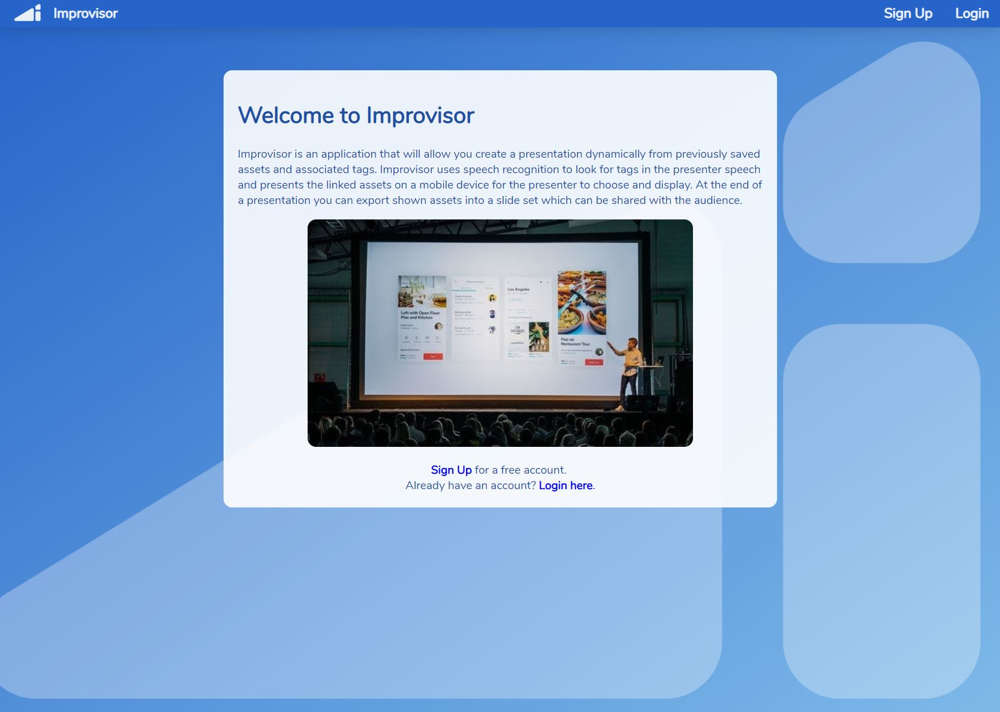
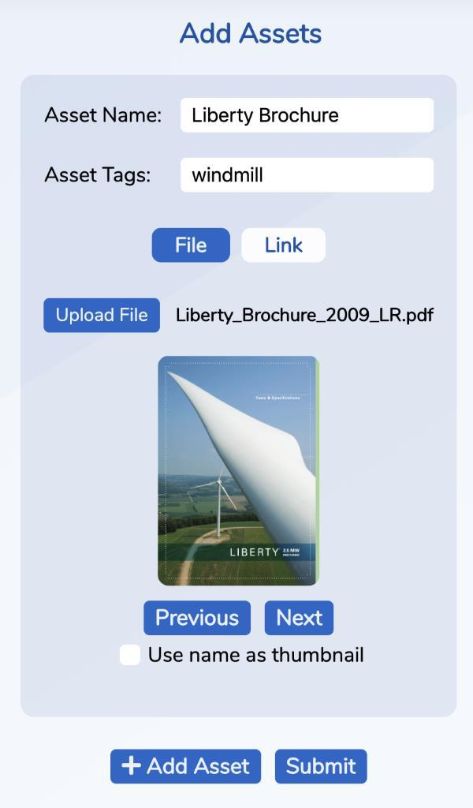
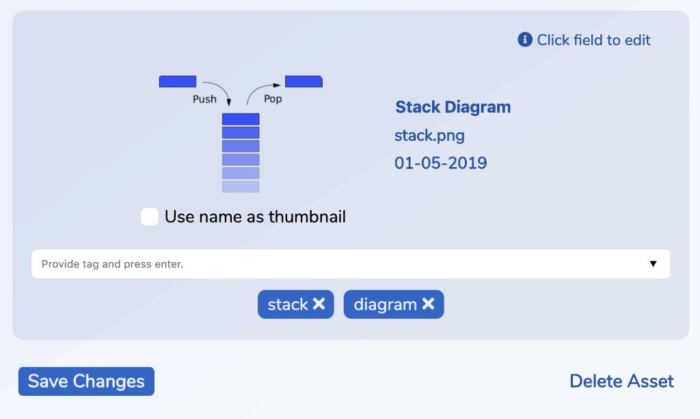
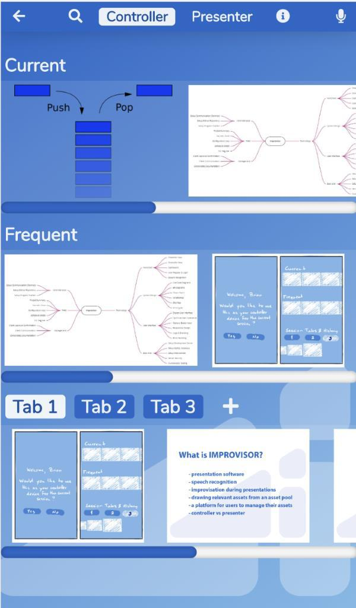
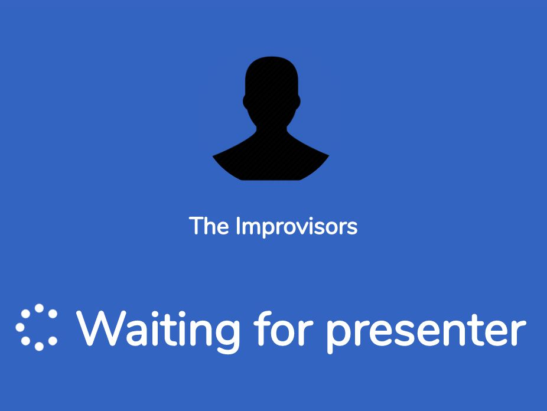
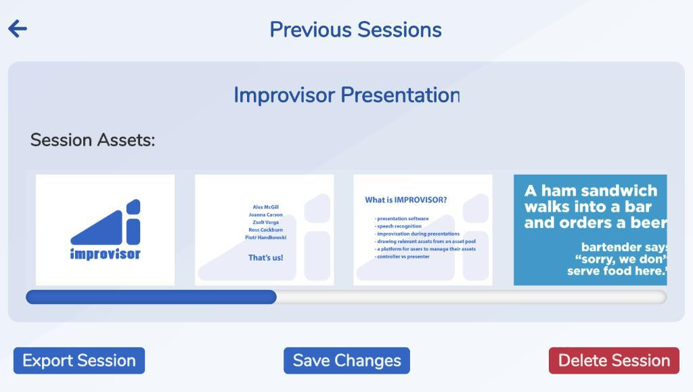
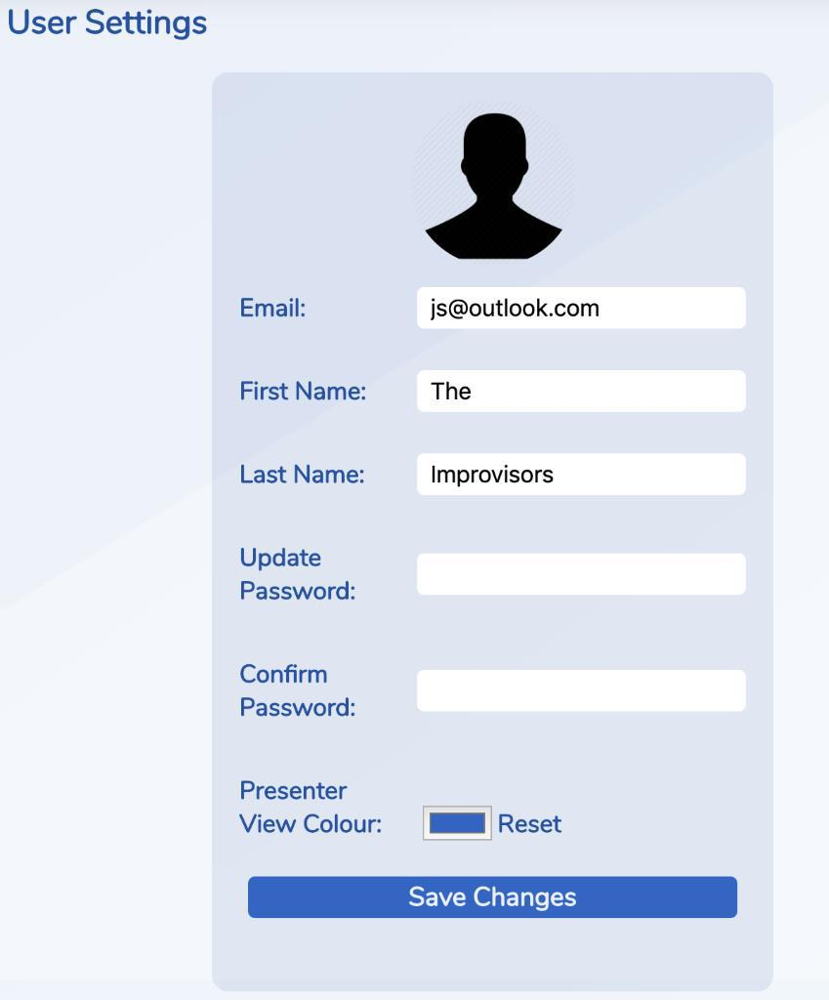

# Improvisor

> Group Project Module 2018-2019 TRI2 @ Edinburgh Napier University (1st place winner)




## Required Development Setup
```sh
(Python 2.x) > pip install -r requirements.txt 
(Python 3.x) > pip3 install -r requirements.txt
```

## Usage

~~ Tested using Python 3.6.7 ~~

Once all of the dependencies have been installed:
* Start up the server using "python run.py"
* Go to http://localhost:5000/ to access the site

## Screenshots

Add Assets:



Edit Assets:



Controller View:



Presenter View:



Session History:



Login:


Login:




## Contributors


| Name | Github |
|--|--|
| Alex McGill | [mcgill-a](https://github.com/mcgill-a)|
| Zsolt Varga | [voltZs](https://github.com/voltZs)|
| Ross Cockburn |[Rossco906](https://github.com/Rossco906) |
| Piotr Handkowski | [hantus](https://github.com/hantus)|


<!-- Markdown link & img dfn's -->
[running]: https://i.imgur.com/keoeAmQ.png
